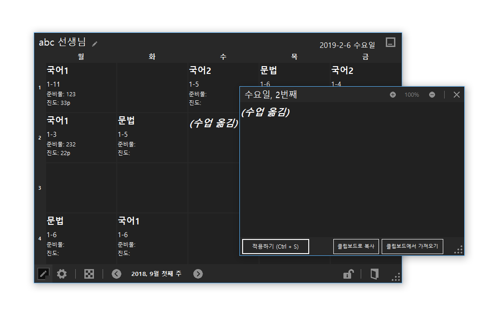

# 쌤테이블 (Ssaemtable)
교사 시간표 메모, 진도 관리 프로그램

## 주요 기능
* 자동으로 생성하고 관리하는 주간 시간표
* 한글과컴퓨터 한글, 마이크로소프트 Word와 같은 워드프로세서의 양식을 그대로 입력 가능
* 하루 또는 전체 단위로 시간표 내보내기/불러오기 가능
* 엑셀로 내용 추출 가능
* 태블릿 PC 등을 고려한 GUI
* 고해상도 디스플레이(HDPI) 환경 대응
* 원클릭 업데이트 기능
